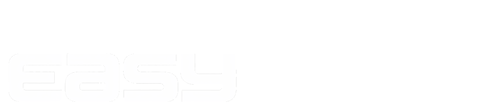

# Image Optimization Planı

## Büyük Görseller (Manuel Optimize Edilmeli)

### 1. tvplus.png (1.95 MB → ~50 KB hedef)
- Boyut: Muhtemelen çok büyük çözünürlük
- Çözüm: Resize to 200x200px, PNG-8 format
- Tool: TinyPNG.com veya ImageOptim

### 2. box2.png (1.55 MB → ~100 KB hedef)  
- Boyut: Yüksek çözünürlük
- Çözüm: Resize to 400x400px, optimize
- Tool: TinyPNG.com

### 3. Disney+.png (376 KB → ~30 KB hedef)
- Çözüm: Resize to 150x150px

### 4. apple.png (210 KB → ~20 KB hedef)
- Çözüm: Resize to 150x150px

## Otomatik Optimizasyon (Kod ile)

### Lazy Loading Ekle
```html

```

### WebP Fallback (Gelecek için)
```html
<picture>
  <source srcset="./assets/netflix.webp" type="image/webp">
  
</picture>
```

## Hızlı Kazanım
1. HTML'deki tüm img'lere `loading="lazy"` ekle
2. Büyük görselleri manuel optimize et (TinyPNG)
3. Duplicate görselleri sil (prime video.png + prime%20video.png)
